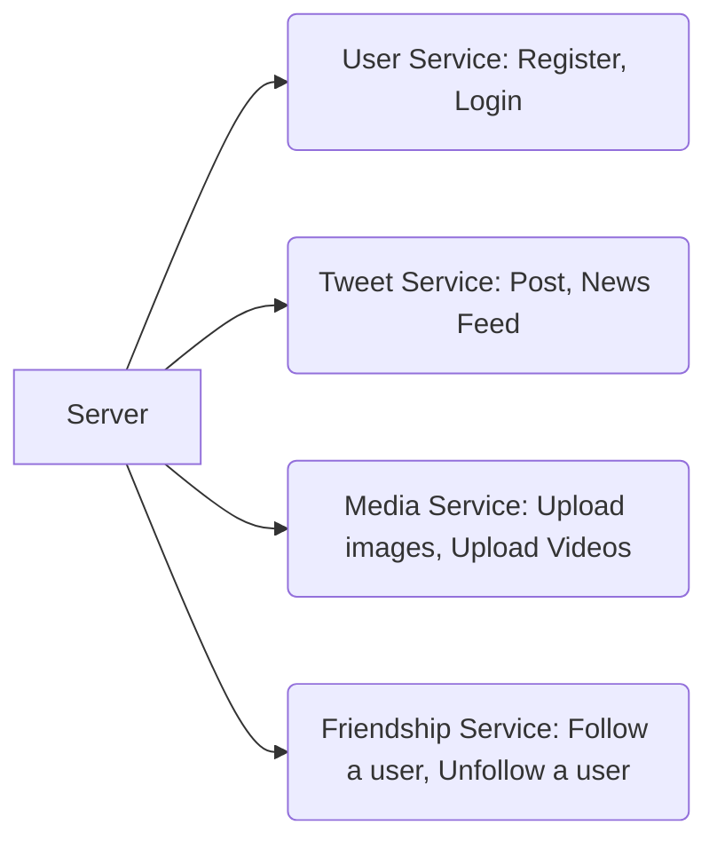

This document is to document the learning process for **System Design**.
A few thoughts about System Design:
1. What are the typical types of system design interviews?
2. How to expand your knowledge base just for system design interviews?
3. Are there routines to tackle system design interview?

A few key concepts:
Load Balancer, Memcache, NodeJS, MongoDB, MySQL, Sharding, Consistent Hashing, Message Queue, Pub & Sub, SOA(Service Oriented Architecture), Google File System, Big Table, Hadoop, Boom filter, etc.

## Good Concepts:
- For any system, consider: how much data does the system handle? how much data does the system need to store?
- Popular hashing algorithm: like 35.      What about md5?
- Scalibility
- It normally does not matter whether to use Relational DB or NoSQL DB. But to support transactions, Relational DB is necessary.(Unless MongoDB 4.0, which just releases ACID support 2018)
- You do need to implement some of the features in NoSQL(Serialization, Secondary Index)
- Most SQL DB does not support Sharding

## Steps:
1. **Scope** the problem: Ask questions; Understand the use cases. Confirm the specifics: number of users per month/day/minute or even second. What are the interfaces. 
2. **Split** the system/feature into sub modules. Normally sketch up an **abstract design** that illustrates the basic components of the system and the relationships between them.
3. **Storage** of the system. Decide what storage to use according to the use cases agreed in above steps. Draft the schemas if relational DB shall be used.
4. **Scale** Address these bottlenecks by using the fundamentals principles of **scalable** system design. Typical technics are Sharding.

## Facts
1. Database single machine read qeury bottleneck
  - MySQL / PosgreSQL, etc: 1k
  - MongoDB /Cassandra: 10K
  - Redis / Memcached: 100k - 1m

**Note**: the number varies on different hardware of course.

2. Social network MAU(Monthly active users)

| Social Network Site      | Monthly Active Users    | Daily Active Users    |
|:-----------------:|:------------------------:|:------------------------:|
|Facebook|2,230,000,000|74M|
|Youtube|1,900,000,000|63M|
|Instagram|1,000,000,000|33M|
|Qzone|563,000,000|18.7M|
|Weibo|376,000,000|12.5M|
|Twitter|336,000,000|11.2M|
|Reddit|330,000,000|11M|
|Pinterest|200,000,000|6.7M|
|Ask.fm|160,000,000|5.3M|
|Tumblr|115,000,000|3.8M|
|Flicker|112,000,000|3.7M|
|Google+|111,000,000|3.7M|
|LinkedIn|106,000,000|3.5M|
|VK|97,000,000|3.2M|
|Meetup|35,300,000|1.2M|

| Social Network App      | Monthly Active Users    | Daily Active Users    |
|:-----------------:|:------------------------:|:------------------------:|
|WhatsApp|1,500,000,000|50M|
|Messenger|1,300,000,000|43M|
|Wechat|989,000,000|33M|
|Instagram|800,000,000|26.7M|
|QQ Chat|783,000,000|26.1M|
|VIBER|249,000,000|8.3M|
|LINE|218,000,000|7.3M|
|Snapchat|200,000,000|6.7M|

Citied from [Top 15 Most Popular Social Network](https://www.dreamgrow.com/top-15-most-popular-social-networking-sites/)
**Note**: Use the DAU * [queries per user] / 86400 to get QPS for a specific service

- Use cache whenever there is much more reads than write

## Main system design questions
- Design a whole system
  - Design Twitter
  - Design Facebook
  - Design Uber
  - Design Whatsapp
  - Design Flight booking system
  - Design Google Drive
- Design a specific functionality
  - Design a feature to stop user from visiting a site too frequently
  - Design a functionality to mark all emails as read
  - Design a button to delete a Tweet

## Scalibility lecture
- key concepts:
  Vertical scaling: add more cpu,ram,hard-drive    
  Horizontal scaling:add more cheaper computer, distribute traffice && storage into these machiens.     
  Caching: save some pre-processed data, like sticky session, pre-quried sqls    
  Load balancing: determine which web server to hit; determine which db to hit if having multiple db    
  Database replication: for faster read; for reduancy safety    
  Database partitioning: for faster performance for some contents, or distributed storage    
  Using NoSQL instead of scaling a relational database    
  Being asynchronous   

- Load Balancer?
  load balancer is even good to protect server: now backend server can be on LAN with load balancer, so they are protected; and we just expose load balancer to clients.
  How does load balancer work?
  There are lots of trade-offs: look at 30:00 of the video. That's all the tradeoffs (http://www.hiredintech.com/system-design/scalability-fundamentals/)
    - round robin: the load balancer works as a fancy DNS machine, take turns to assign task/request to machine 1,2,3,4...etc. (if we do `nsloopup google.com` on google.com, we can see google does that)
    - store states/sessions into a dedicated server. but it indroduces server-failure issue. -use RAID, raplication
      RAID0: strip data at two hardrives, little on each
      RAID1: mirror data. store at both places
      RAID10: combination of RAID0 && RAID1.
      RAID5: 3 drives only 1 of them is used for reduendency.
      RAID6: multiple drives. any drive can die, then replace, and no data lost.
    - split by the type of files request: html server, image server; load balancer
    - split based on actual load (less possible), send package to less busy server
  - Options:
    - Software:
      - ELB: elastic load balancer
      - HAProxy
      - LVS 
    - Hardware:
      - Barracuda
      - Cisco
      - Citrix: over-priced, $20k 
      - F5
  Problem: sticky session (if you revisit the site multiple times seprately, you will still hit the same server)
    - can store serverID in the cookie (one downside: safety, showed the whole world about server IP). So again, can store a random number/hashed value on Load Balancer. It shows which serverID to hit once revisiting. Remember which back-end server to send cookie to.
- Caching:
  file-based caching approach: send .html out.
    down-side: 1. space. 2. old generated files are really hard to change.
  mysqul-query cashed: for identical sql request
  memcached: store in memory of the idetical query. Like a table. store <key, value>.
    next time when checking, try look up key.
    Down-side: run out of ram. Solution: LRUCahe, remove old records(double-linked-list)

- Replication:
  Master && multiple Slaves
    advantage: 1. Same request/query will be paste to all slaves, so master fail, just put up one salve; 2. If READ heavy, they are redundant server to lots readings.
    disadvantage:
  Must have at least load balancer: that is one-point-failure if just one load balancer

- Partitioning:
  based on user informaiton, like name. Put common user (same last name) into certain servers.

- Bottleneck: data traffice and data storage
- 
------Example
- 1:26:00 of the video (http://www.hiredintech.com/system-design/scalability-fundamentals/)
We have backend web server
Sticky session: use cookie and store server ID
Use load balancer that two web server connects:
Use load balancer to link to the two master db:
  Two master db that talks to each other: master-master replication
Now we need 2 load balancer to prevent one-point-failure at the webServer-db connection.
Now we also need 2 load balancers at the (which web server to hit) level, that is another 1-pointer-failure
Switch for the complex connections: 
  Now we have so many connections: we need switches to handle the connections.
  We need at least two ports on each device to: go to the correct switch. Becareful with loop.
- Eventually we will handle: (1:34:00)
  Scalibility
  Redundancy
  High probablity of up time
  Resolution against failure

- Another big issue:
  What is ISP goes down? The whole package mentioned above go down?
    Amazon solution, another ISP, called avalibility zone: like west, asia, south american.
    How to distribute IP on different data center? Load Balancer at the DNS level, global Load Balancer.  (Note, if in one building, could be staying at this building)
      Well, if a building is gone, once your TTL(Time to live) is expired, you will be re-route to another ISP building.

- Before getting into building:
  Firewall, only a few ports are open: like tcp80, 443, 22 (ssh)
  can allow https before first load balancer inside building, and decrypt it after first load balancer
  at db lever, only 3306 is allowed.
Reason to lock, for example, 3306 not allowed at entering building? Because no one needs to inject query to db from outside of building; sql query usually only need to be done within the building, so lock the building up, don't allow bad sql injection : )

### URL convention Example Final (http://www.hiredintech.com/system-design/final-thoughts/)
- simple rules:
  Always start a single machine
  Benchmark the bottle necks, where it indroduces complexity. (No need to add extra complexity)
  Think about the questions like: why sql vs. non-sql?

- Scalable design:
  1. Application, web server, handle requests/traffic
    * start with 1 server
    * it's better to measure the spark traffic (highest we get)
    * add load balancer, and a cluster of servers. (could use amazon elastic load balancer, to automatically add more servers)

  2. Data Storage
    1) Billions of object,  2) each object is small, 3) no relationship between object, 4) read 9x more than write (360read/s, 40writes/s), 5) 3TB urls, 36GB of hashes
    We can use sql or non-sql
    In example, go with MySQL
      widely used
      Mature tech
      Clear scaling paradiams(sharding, master/slave replication, master/master replication)
      Used by fb, twitter, google.
      * index lookups are very fast (as fast as non-sql)
    mappings:
      hash: varchar(6)
      original_url: varchar(512)

    Over years, it holds 3TB data. Storage-wise, it's okay. However, how to serve up quickly?
    
    * First, Use one MySQL table with two varchar fields
    * Create uinique index on the hash(36GB+). We want to hold it in memory. However, we need to look up fast.
    * For 1st stemp, vertical scaling of the MySQL machine, adding more RAM (nowadays ram are cheaper too : )
    * Eventually need to partition the data, into 5 partitions: 600GB of data, 8GB of indexes on each machine. (Partitioning early on, it helps to scale later, just add more nodes)
    * One day, if read/write are super different, Master-Slave, ... 
      write to master, and read from slaves.
## Design Twitter
### Scope
1. List all the functionalities of Twitter: register, login, user profile read and edit, upload images and video, search tweets and users, post, news feed, follow and unfollow a user, hashtag, etc.
2. Communicate with interviewer to focus on a subset of the above functionalities under limited time. Let's say post, news feed, upload images and videos, follow and unfollow a user, register, login.
3. Agree on active users based on statistics. Decide the daily AUN (active user numbers), the peak active users (assume daily active users count * 3). For example, Twitter has roughly 150 million active users, guess they visit Twitter 60 times on average a day. So around the level of 100k active users per second. Hence the peak users could be 300k. We can further guess most, like 90%, of the visits are read queries, and write queries take up the rest 10%. 
   - The AUN (active user number) can be extremely helpful: they decide what server to use: 100 AUN just needs a desktop as server; 1k AUN needs a good dedicated web server; 1m AUN means you need a cluster of web servers. And the complexity of the three architecture is hugely different.
   - The AUN also decides what database type to use:
     - A single web server can handle around 1k AUN (realistically, considering the bottleneck of a relational DB usage and business logic)
     - A single SQL DB can handle around 1k AUN (considering the bottleneck of a relational DB, it could be less if the queries are written badly, such as nested joins and many sub queries)
     - A single NoSQL DB (Cassandra) can handle around 10k AUN
     - A single NoSQL DB (Memcached) can take 1M AUN
### Split
1. Reiterate the core functionalities and draw a component diagram for them

2. Decide where to put separate modules(services): could be on the same server or distributed servers depending on the nature, failure consequence and usage frequency of the modules.
### Storage
1. Decide the storage strategy for each modules
  - Relational DB: User Service
  - NoSQL DB: Tweet Service and Friendship Service (Tweets, Followers mapping)
  - File System: Media Service
  - Caching: Just to boot up reading speed
2. Draw schemas

| User Table(User Service)        | Friendship Table(Friendship Service)         |Tweet Table(Tweet Service)    |
|:-----------------:|:------------------------:|:-----------------:|
| id        integer |from_user_id   Foreign Key|id          integer|
| username  varchar |to_user_id     Foreign Key|user_id Foreign Key|
| email     varchar |created_at       timestamp|content     varchar|
| password  varchar |                          |created_at timestamp|

3. System Architect
- Pull
  - Read most recent k tweets for each friend and merge to get overall most recent k tweets
  - Time complexity
    - Read: O(N) (number of friends) DB Read + k(merge) in memory algorithm
    - Write: O(1) DB Write
    - Disadvantage: Blocking read operation can be disturbing
- Push
  - Fanout to each follower's local News Feed list
  - Time complexity
    - Read: O(1) DB Read
    - Write: O(N) (Number of followers), DB Write. BUT this can be asynchronous
    - Disadvantage: There could be too many followers (Elon Musk, Lady Gaga, etc)

| News Feed Table     |
|:-------------------:|
| id        integer |
| owner_id  Foreign Key |
| tweet_id  Foreign Key |
| created_at  timestamp |

4. Examples

| Pull     | Push | Pull and Push |
|:-------:|:------:|:------------:|
|Facebook | Twitter|Instagram|

### Scale

1. Optimisation
  - User Serice: Use Cache(Cache aside/Cache through) to speed up read (Session + Cookie)
  - Use SQL based DB, because we need to search on multiple attributes.

2. Maintenance TBD

3. Single point failure
  - Sharding: loading balancing, put data on different machines according to specific rules
    - Vertical Sharding: Sharding by column (Cannot Sharding a huge table with just two columns)
    - Horizontal Sharding: Sharding by row_key using Consistent Hashing
  - Replica: split reading. (Blockchain)

## Design UBER
1. Requirements 
   Same requirements between user && driver: GPS tracking, detect pickup/drop off, cost calculation
   Design a web app (or mobile app) for end user to make/cancel car reservation, make payment, rate driver.
   Design a web app (or mobile app) for driver to accept/decline car reservation, accept payment, rate passenger.
   Extra features beyond basics: car pool, split cost, rush-hour rate calculation.

2. Identify the end systems:
   Backend server that handles communication, data tracking, payment trasaction...etc
   Passenger user app
   Driver user app

3. Inputs and outputs of each end system:
   **Server should store every piece of information received or change to database during this process**
   Server-input:
     * Passenger create account, login, log off
     * Driver create account, login, log off
     * Passenger/Driver payment information
     * driver locations
     * passenger locations
     * GPS location data before && during the trip
     * request to pair driver && passenger
     * request to start trip
     * request to end trip
     * request to drop reservation from driver
     * request to drop reservation from passenger
     * request to calculate cost per trip
     * accept rating, comment, report ... 

   Server-output: 
     * ack passenger account generation, login, logoff
     * ack driver account generation, login, logoff
     * ack driver/passenger payment info and store to db
     * broadcast driver locations to passenger
     * broadcast passenger locations to driver
     * response pair confirmation to driver && passenger with contact information of driver&&passenger
     * start a trip between driver && passenger
     * end a trip between driver && passenger
     * calculate recommended route and send to driver&&passenger
     * response reservation dropped from driver with panelty
     * response reservation dropped from passenger with panelty
     * response cost calculated to passenger and intiate payment charge to passenger
     * response cost calculated to driver and initiate payment to driver
     * store rating, comment, report into database. Trigger messages to coresponding party.

   Passenger-input: data that passenger receives
     * ack of login and ready to pick driver
     * status of drivers around current location
     * auto-matched driver and related information about driver, car condition, price rate
     * confirmation of car reservation with driver's info
     * trip route and estimated time
     * GPS tracking of car arriving or GPS tracking during the trip
     * notification of payment
     * notification of canceled trip
     * prompt to rate and comment
     * phone call from driver (extenal)

   Passenger-output: action that passenger takes
     * create account
     * login
     * add payment information
     * put current location and destination location
     * select type of uber car, and start searching(matching)
     * accept/decline auto-matched driver
     * call driver (extenal)
     * cancel reservation
     * put comment, rating, or report to the system
     * automatically pay (be charged) of the trip cost from server

   Driver-input:
     * ack of login and ready to start driving
     * auto-recommended passenger's information: location, passenger rating
     * confirmation of reservation && current waiting location
     * trip route and estimated time
     * GPS tracking of car arriving or GPS tracking during the trip
     * notification of payment
     * notification of trip cancelation from passenger
     * prompt to rate and comment passenger
     * phone call from passenger (extenal)
     * receive payment from server

   Driver-output:
     * create account
     * login and set status avaialbe
     * add payment info
     * accept/decline recommended match
     * call passenger (extenal)
     * cancel reservation
     * put comment && rating of passenger

4. Summarize core features and tools to implement
   * account management: 
   * payment integration: paypal integration? some other credicar processing tools
   * matching algorithm: core problem to solve. Figure out the cheapest match for passenger, and time&&cost efficient match for driver. There might be lots of constraints to think about for the matching algorithm: cost&&time to pick up passenger around multiple driver, based on driver preference to filter type of trip (farest distance to travel)
   * trip process monitoring, notification: RESTful calls between server && driver && passenger. 
   * GPS location tracking and route calculation: Google map?
   * trip cost calculation: calculated based on route length, trip time, rate at specific time, complains filed by passenger
   * rating && comment system: RESTful post from driver/passenger

5. Technologies potentially needed:
   Tools:A server to handle RESTful calls, support live connection between nodes, handle trip matching algorithm, handle cost calculation.
   * Node.js with expressJS: provide RESTful API 
   * Socket.io for concurrent communication between server, user, driver in the same socket room.
   * Data storag: Sql or non-sql? Why? Later on, it seems easy to split data by region, so non-sql db seems okay to use.
   * Algorithm: How does heavy calculation handled on Nodejs? Should it be something to do with multi-threading?

6. How does the system scale? What are the limits and trade-off in current design? What improvmenet can be done to design it differently?
   First, assume everything is running based off one giant server: all conversations and calculation are handled via this server.
   Second, the size of data might be too costly to search, calculate, and it's not practical to store everything on one machine:
     * user/driver account info might be too large
     * concurrent calculation for trip matching
     * number concurrent trip monitoring and conversation
     * concurrent calculation for trip cost
   Therefore, it seems wiser to split onto multiple servers. 
   Third question: in which way to split the data? It seems we need to treat different type of data separately
     * For actively moving driver and user: we can store their location data dynamically by region. Once moved into/out of one regin, poll the information from one server into another server. Here, it's wise to use HashTable to store as <userID, everything about this user>. Calculation algorithm may also happen on this server, because both driver && passenger are on this server, defined by region. 
     * Now we've splitted data into servers by region. However, for same region, it might be too much work for one machine. We need to split data aross different machines for same region. Here, use another Hash lookup table to store <live tripID, server ID> to split data into even smaller sections to fit in different server. Now we can have more **regionServer**.
     * A improvement that can be done: for relative static information account,payment,rating, they are only used once or twice during a trip. It might be okay to store these information on a type of server that specifically handles account look up, let's call it **accountServer**. Again, there might be too much account info to store, we can build lookup tables to store <accountID, serverID>. Double again, do MapReduce to hash the keys so that we can split the look up table if the table is too big to store on one server.